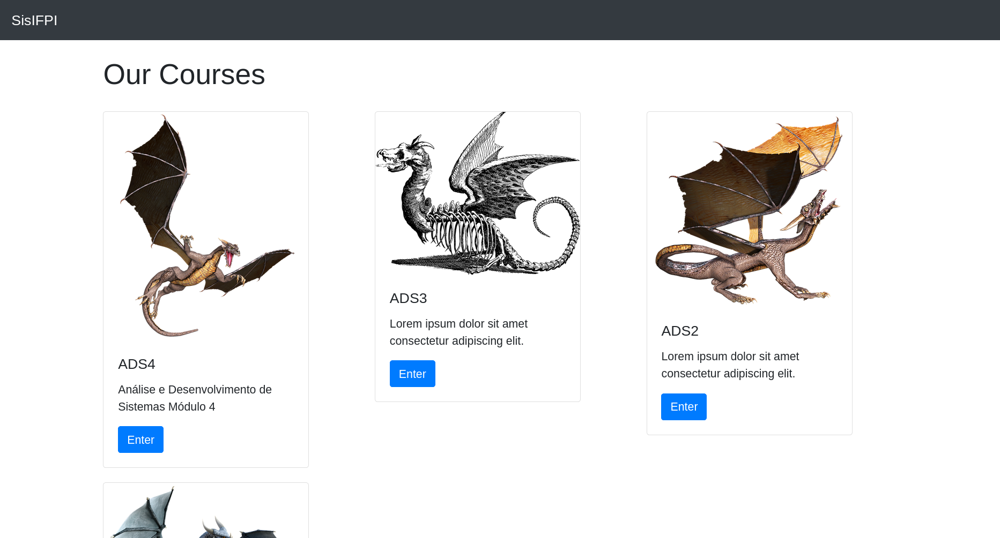
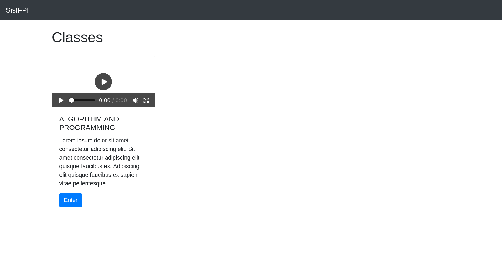

# SisIFPI

SisIFPI is a web application for managing courses, classes, and user authentication, built with Django. Users can sign up, log in, browse courses, view classes, and leave comments on class pages.

## Project Purpose

This app was created as a simple project for my undergraduate course. Its main goal is to demonstrate basic web development concepts using Django, including user authentication, course and class management, and AJAX interactions.

## Features

- User registration and login
- Course listing with thumbnails and descriptions
- Class detail pages with video content
- AJAX-powered comment system for classes
- Admin interface for managing data

## Screenshots

<!-- Add screenshots here -->
- 
- 
- 
- 

## Getting Started

### Prerequisites

- Python 3.10+
- MySQL (or update `settings.py` for your preferred database)
- [Poetry](https://python-poetry.org/) or `pip` for dependency management

### Installation

1. **Clone the repository:**
   ```bash
   git clone https://github.com/yourusername/sisifpi.git
   cd sisifpi
   ```

2. **Install dependencies:**
   ```bash
   poetry install
   # or
   pip install -r requirements.txt
   ```

3. **Configure the database:**
   - Update `core/settings.py` with your database credentials.

4. **Apply migrations:**
   ```bash
   poetry run python manage.py migrate
   # or
   python manage.py migrate
   ```

5. **Create a superuser (required for admin access):**
   ```bash
   poetry run python manage.py createsuperuser
   # or
   python manage.py createsuperuser
   ```

6. **Run the development server:**
   ```bash
   poetry run python manage.py runserver
   # or
   python manage.py runserver
   ```

7. **Access the app:**
   - Open [http://127.0.0.1:8000/home/](http://127.0.0.1:8000/home/) in your browser.

## Admin Management

To add, update, or delete courses and classes, you must create a Django superuser and use the built-in admin interface.

- Log in at [http://127.0.0.1:8000/admin/](http://127.0.0.1:8000/admin/) with your superuser credentials to manage all content.

## Usage

- Sign up for a new account or log in.
- Browse available courses.
- Click on a course to view its classes.
- Click on a class to watch the video and leave comments.
- Use the admin panel at `/admin/` to manage users, courses, and classes.

## Contributing

Pull requests are welcome! For major changes, please open an issue first to discuss what you would like to change.

## License

[MIT](LICENSE)
